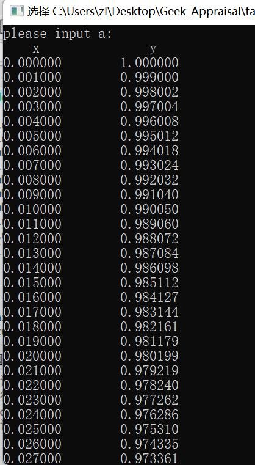

# 任务1实验报告模板

### 题目

&nbsp;&nbsp;&nbsp;&nbsp;运用C语言，使用Euler法、梯形法、改进Euler法、Taylor级数法、Runge-Kutta法、线性多步法等任意一种方法，实现对下述简单微分方程的各个瞬时值与最终定态（收敛值）求解：

&emsp;&emsp;&emsp;&emsp;&emsp;&emsp;&emsp;&emsp;=a\\end{matrix}\\right.)

注：a为常数，可由用户输入确定该值。你可以使用scanf()函数来获取输入的a值。瞬时值求解时步长为0.001，定态误差应小于0.001。

***

### 运行结果截图：

（以下图为例，放入运行结果的截图，结果打印的输出格式可自己设置）

---

### 思考题（请给出思考结论）：

1. 当a为1，给出x在区间[0，25]之间方程的各个瞬时值，该方程的最终定态（收敛值）是多少？

   答：0.000999

2. 当a为e，给出x在区间[0，25*e]之间方程的各个瞬时值，最终定态（收敛值）是多少？（e为指数）

   答：0.000999

3. 当a为π，给出x在区间[0，25*π]之间方程的各个瞬时值，最终定态（收敛值）是多少？

   答：0.000999

4. 上面三小问中不同初值的方程最终都能取到各自的最终定态（收敛值），为什么？

   答：当x趋于无穷大时，微分方程的解单调递减，最终趋于0

#### 附加题：

使用C语言对上述前三问的数值求解过程用Excel画图显示，即将每一个x对应的y值在坐标系上画出来，并将绘图结果附在本文档中。

